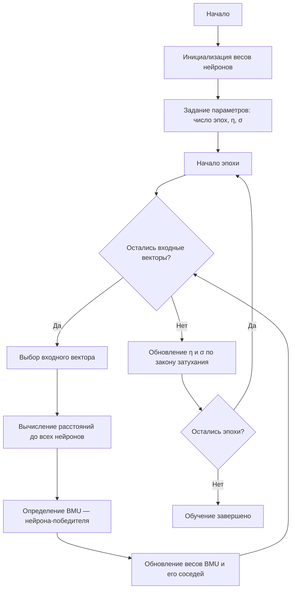

```mermaid
flowchart TD
    A[Начало] --> B[Инициализация весов нейронов]
    B --> C[Задание параметров: число эпох, η, σ]
    C --> D[Начало эпохи]
    D --> E{Остались входные векторы?}
    E -- Да --> F[Выбор входного вектора]
    F --> G[Вычисление расстояний до всех нейронов]
    G --> H[Определение BMU — нейрона-победителя]
    H --> I[Обновление весов BMU и его соседей]
    I --> E
    E -- Нет --> J[Обновление η и σ по закону затухания]
    J --> K{Остались эпохи?}
    K -- Да --> D
    K -- Нет --> L[Обучение завершено]
```