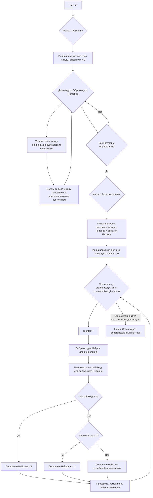

```mermaid
graph TD
    A[Начало] --> B{Фаза 1: Обучение};

    B --> C[Инициализация: все веса между нейронами = 0];
    C --> D{Для каждого Обучающего Паттерна};
    D --> E[Усилить веса между нейронами с одинаковым состоянием];
    E --> F[Ослабить веса между нейронами с противоположным состоянием];
    F --> D;
    D --> G{Все Паттерны обработаны?};
    G -- Да --> H{Фаза 2: Восстановление};
    G -- Нет --> D;

    H --> I[Инициализация: состояние каждого нейрона = входной Паттерн];
    I --> J[Инициализация счетчика итераций: counter = 0];
    J --> K{Повторять до стабилизации ИЛИ counter < Max_Iterations};
    K --> L[counter++];
    L --> M[Выбрать один Нейрон для обновления];
    M --> N[Рассчитать Чистый Вход для выбранного Нейрона];
    N --> O{Чистый Вход > 0?};
    O -- Да --> P[Состояние Нейрона = 1];
    O -- Нет --> Q{Чистый Вход < 0?};
    Q -- Да --> R[Состояние Нейрона = -1];
    Q -- Нет --> S[Состояние Нейрона остаётся без изменений];

    P --> T;
    R --> T;
    S --> T;

    T[Проверить, изменилось ли состояние сети];
    T --> K;
    K -- Стабилизация ИЛИ max_Iterations достигнуты --> U[Конец: Сеть выдаёт Восстановленный Паттерн];
```