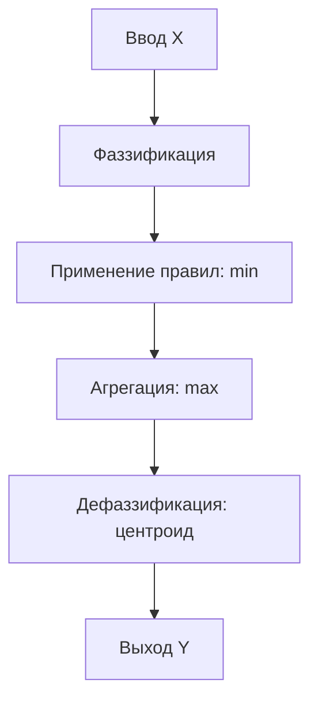
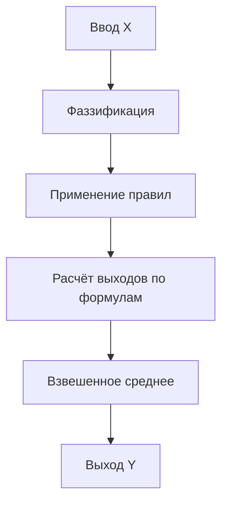
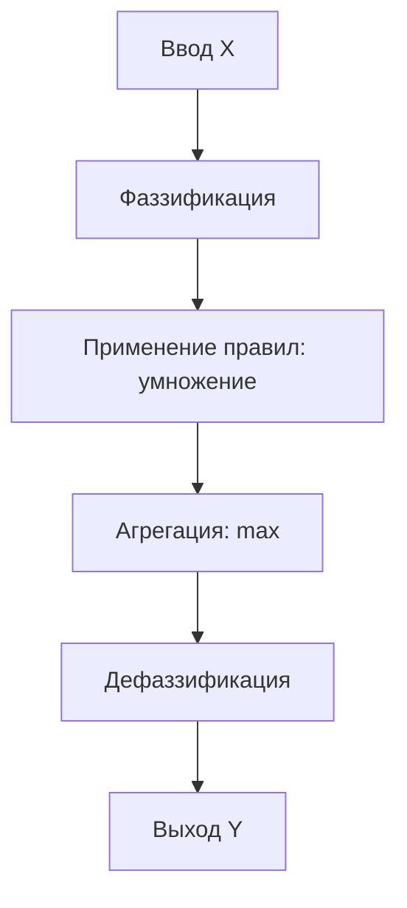
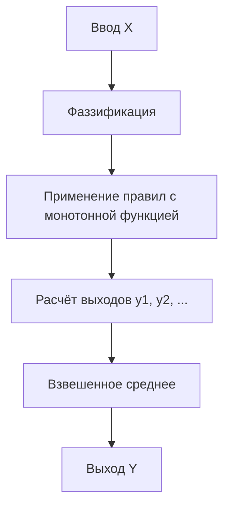

### Нечеткие логические выводы и высказывания
| Понятие                       | Описание                                                                                                     |
| ----------------------------- | ------------------------------------------------------------------------------------------------------------ |
| **Нечеткое высказывание**     | Лингвистическое утверждение с неопределённой (нечёткой) истинностью, например: «Температура высокая».        |
| **Нечеткий логический вывод** | Процесс получения нового знания из нечетких высказываний с использованием правил логики и нечетких множеств. |
| **Отличие**                   | Высказывание — это входная информация, логический вывод — процесс обработки этой информации.                 |

### Операции над нечеткими множествами
| Операция           | Обозначение                                     | Примерное соответствие классической логике |
| ------------------ | ----------------------------------------------- | ------------------------------------------ |
| **Объединение**    | $\mu_{A \cup B}(x) = \max(\mu_A(x), \mu_B(x))$  | дизъюнкция (ИЛИ)                           |
| **Пересечение**    | $\mu_{A \cap B}(x) = \min(\mu_A(x), \mu_B(x))$  | конъюнкция (И)                             |
| **Дополнение**     | $\mu_{\neg A}(x) = 1 - \mu_A(x)$                | отрицание (НЕ)                             |
| **Импликация**     | Зависит от модели (например, Мамдани, Цукамото) | логическое следование                      |
| **Дефаззификация** | Преобразование нечеткого значения в четкое      | —                                          |

# Модели нечеткого логического вывода

## Модель Мамдани

---

## Модель Сугено

---

## Модель Ларсена

---

## Модель Цукамото

